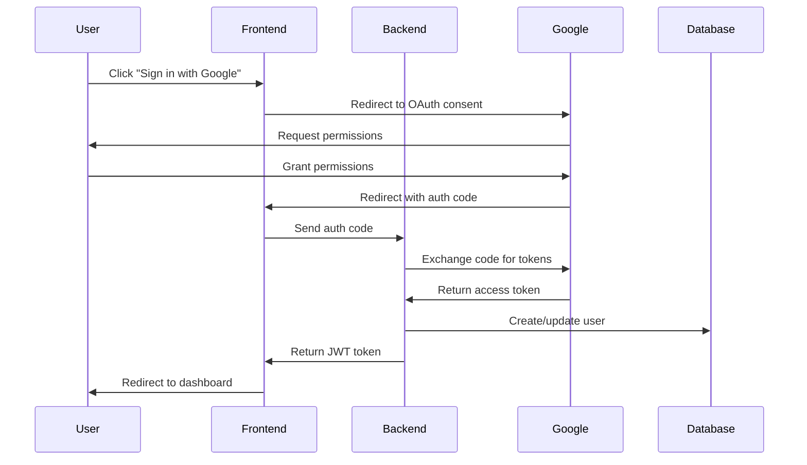
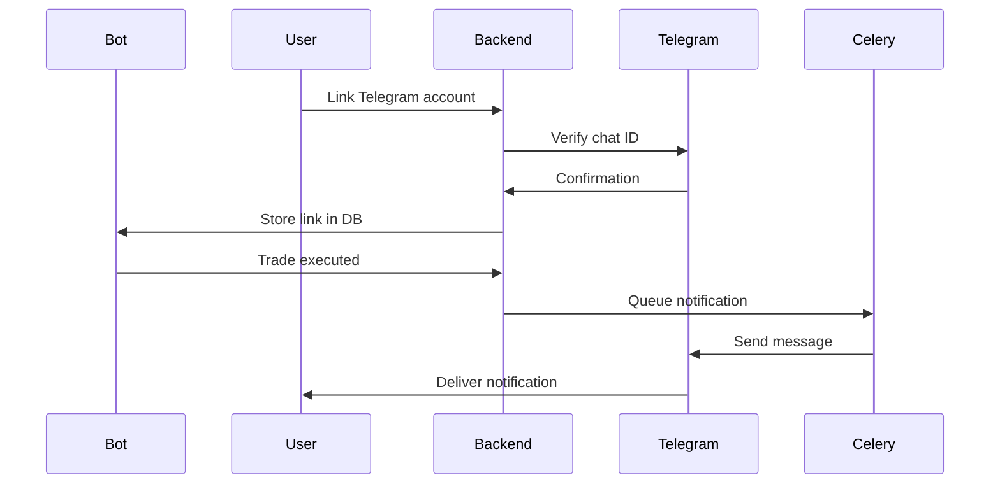
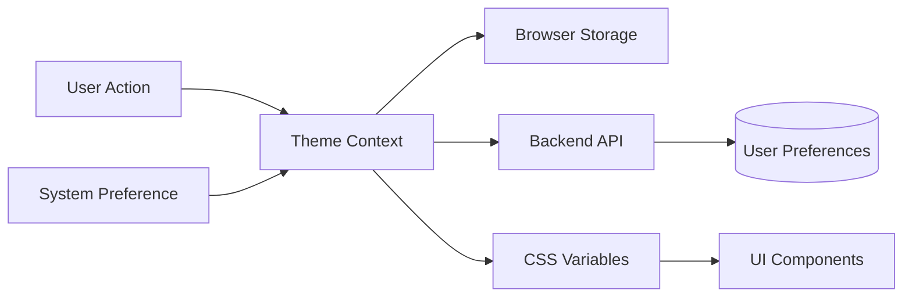

# สรุปการดำเนินงาน เฟส 3 (Phase 3)

### Quick Links
- [Phase 3 Guide](PHASE3_GUIDE.md)
- [Phase 2 Summary](PHASE2_SUMMARY.md)
- [Roadmap](ROADMAP.md)

## Phase 3 Objectives

Phase 3 focuses on enhancing user experience through advanced authentication, real-time notifications, customizable UI, and expanded internationalization support. This phase transforms the platform into a truly global, user-friendly trading system.

## Planned Features

### 🔐 1. Google OAuth Integration

#### Implementation Plan
- **OAuth 2.0 Flow**: Implement secure Google Sign-In
- **User Management**: Automatic profile creation and linking
- **Session Management**: JWT-based authentication with refresh tokens
- **Security**: CSRF protection and secure token storage

#### Technical Components
- Backend API endpoints for OAuth callback
- Frontend OAuth button and redirect handling
- User model extensions for OAuth provider data
- Token refresh and validation middleware

#### Files to Create/Modify
- `apps/backend/src/auth/oauth_service.py` - OAuth service implementation
- `apps/backend/src/auth/google_provider.py` - Google-specific OAuth logic
- `apps/frontend/src/components/auth/GoogleSignIn.tsx` - Sign-in button component
- `apps/backend/prisma/schema.prisma` - Add OAuth fields to User model
- Environment variables for Google credentials

### 📱 2. Telegram Link & Notification

#### Implementation Plan
- **Bot Integration**: Connect Telegram bot via Bot API
- **Account Linking**: Secure user verification process
- **Notification Engine**: Real-time alert system
- **Preference Management**: User-configurable notification settings

#### Notification Types
- Trade execution confirmations (Buy/Sell with PnL)
- Risk alerts (Drawdown warnings, Circuit breaker trips)
- System notifications (Bot status changes)
- Daily performance summaries

#### Technical Components
- Telegram bot webhook handler
- Notification queue system (Celery tasks)
- User-Telegram account linking table
- Notification preference storage
- Template system for messages

#### Files to Create/Modify
- `apps/backend/src/services/telegram_service.py` - Telegram bot service
- `apps/backend/src/services/notification_service.py` - Notification dispatcher
- `apps/backend/src/api/telegram.py` - Telegram API endpoints
- `apps/backend/prisma/schema.prisma` - TelegramLink and NotificationPreference models
- `apps/frontend/src/components/settings/TelegramLink.tsx` - UI for linking

### 🎨 3. Dynamic Theme / Config GUI

#### Implementation Plan
- **Theme System**: Light, Dark, and Auto modes
- **Color Customization**: User-defined color schemes
- **Layout Options**: Customizable dashboard layouts
- **Persistent Settings**: Save preferences to database

#### Theme Features
- CSS-in-JS with dynamic variables
- System preference detection
- Smooth theme transitions
- Custom color picker
- Preview mode

#### Technical Components
- Theme provider context
- User preference storage
- Theme configuration UI
- Real-time preview
- SSR-compatible theme loading

#### Files to Create/Modify
- `apps/frontend/src/contexts/ThemeContext.tsx` - Theme management
- `apps/frontend/src/components/settings/ThemeCustomizer.tsx` - Theme UI
- `apps/frontend/src/styles/themes.ts` - Theme definitions
- `apps/backend/src/api/preferences.py` - User preferences API
- `apps/backend/prisma/schema.prisma` - UserPreferences model

### 🌏 4. Additional Language Support (Chinese & Japanese)

#### Implementation Plan
- **Translation Files**: Create complete zh and ja translation sets
- **Language Selector**: Dropdown with flag icons
- **Persistent Language**: Save preference to user profile
- **Fallback Handling**: Default to English for missing translations

#### Languages
- 🇨🇳 **Chinese (Simplified)** - 简体中文
  - Complete UI translation
  - Number formatting (Chinese numerals optional)
  - Date/time formatting (Chinese calendar support)
  
- 🇯🇵 **Japanese** - 日本語
  - Complete UI translation
  - Proper honorifics in messages
  - Date/time formatting (Japanese calendar)

#### Technical Components
- react-i18next configuration extension
- Translation JSON files for zh and ja
- Language detection middleware
- Number and date formatters
- RTL preparation for future languages

#### Files to Create/Modify
- `apps/frontend/src/locales/zh/common.json` - Chinese translations
- `apps/frontend/src/locales/ja/common.json` - Japanese translations
- `apps/frontend/src/i18n/config.ts` - Add new languages
- `apps/frontend/src/components/LanguageSelector.tsx` - Language dropdown
- Translation utilities for number/date formatting

## Technical Architecture

### Authentication Flow


### Telegram Notification Flow


### Theme System Architecture


## Database Schema Extensions

### OAuth User Fields
```prisma
model User {
  id            String   @id @default(uuid())
  email         String   @unique
  username      String?
  
  // OAuth fields
  googleId      String?  @unique
  oauthProvider String?
  profilePicture String?
  
  // Existing fields...
  createdAt     DateTime @default(now())
  updatedAt     DateTime @updatedAt
}
```

### Telegram Integration
```prisma
model TelegramLink {
  id        String   @id @default(uuid())
  userId    String   @unique
  user      User     @relation(fields: [userId], references: [id])
  chatId    String   @unique
  username  String?
  verified  Boolean  @default(false)
  createdAt DateTime @default(now())
  updatedAt DateTime @updatedAt
}

model NotificationPreference {
  id              String  @id @default(uuid())
  userId          String  @unique
  user            User    @relation(fields: [userId], references: [id])
  
  tradeAlerts     Boolean @default(true)
  riskAlerts      Boolean @default(true)
  systemAlerts    Boolean @default(true)
  dailySummary    Boolean @default(true)
  
  createdAt       DateTime @default(now())
  updatedAt       DateTime @updatedAt
}
```

### User Preferences
```prisma
model UserPreference {
  id            String   @id @default(uuid())
  userId        String   @unique
  user          User     @relation(fields: [userId], references: [id])
  
  theme         String   @default("auto") // light, dark, auto
  language      String   @default("th")   // th, en, zh, ja
  primaryColor  String?
  secondaryColor String?
  accentColor   String?
  
  dashboardLayout String @default("grid") // grid, list
  refreshInterval Int    @default(30)      // seconds
  
  createdAt     DateTime @default(now())
  updatedAt     DateTime @updatedAt
}
```

## API Endpoints Summary

### Authentication (`/auth`)
- `POST /auth/google/login` - Initiate Google OAuth
- `GET /auth/google/callback` - OAuth callback handler
- `GET /auth/me` - Get current user
- `POST /auth/logout` - Logout user

### Telegram (`/telegram`)
- `POST /telegram/link` - Link Telegram account
- `POST /telegram/unlink` - Unlink Telegram account
- `GET /telegram/status` - Check link status
- `POST /telegram/verify` - Verify linking code
- `POST /telegram/notify` - Send test notification

### User Preferences (`/user/preferences`)
- `GET /user/preferences` - Get all preferences
- `PUT /user/preferences` - Update preferences
- `PATCH /user/theme` - Update theme only
- `PATCH /user/language` - Update language only

### Notifications (`/notifications`)
- `GET /notifications/history` - Get notification history
- `POST /notifications/test` - Send test notification
- `PUT /notifications/preferences` - Update notification settings

## Dependencies

### Backend
```txt
# OAuth
google-auth==2.27.0
google-auth-oauthlib==1.2.0
google-auth-httplib2==0.2.0

# Telegram
python-telegram-bot==20.7
```

### Frontend
```json
{
  "dependencies": {
    "@react-oauth/google": "^0.12.1",
    "react-i18next": "^14.0.0",
    "i18next": "^23.7.0",
    "next-themes": "^0.2.1"
  }
}
```

## Testing Strategy

### Unit Tests
- OAuth service token validation
- Telegram message formatting
- Theme color validation
- Translation key completeness

### Integration Tests
- Complete OAuth flow
- Telegram bot webhook handling
- Theme persistence across sessions
- Language switching

### End-to-End Tests
- User sign-up via Google OAuth
- Telegram account linking process
- Theme customization and persistence
- Multi-language navigation

## Security Considerations

### OAuth Security
- ✅ Validate state parameter to prevent CSRF
- ✅ Store tokens in httpOnly cookies
- ✅ Implement token refresh mechanism
- ✅ Secure redirect URI validation
- ✅ Rate limit OAuth endpoints

### Telegram Security
- ✅ Validate webhook signatures
- ✅ Encrypt chat IDs in database
- ✅ Rate limit notification sending
- ✅ Never send sensitive data (API keys, passwords)
- ✅ Implement notification opt-out

### Data Privacy
- ✅ GDPR compliance for user data
- ✅ Secure deletion of OAuth tokens
- ✅ User data export capability
- ✅ Privacy policy updates

## Performance Considerations

### Theme Performance
- CSS custom properties for instant theme switching
- Minimize JavaScript theme calculations
- Cache theme preferences in localStorage
- Lazy load theme customizer components

### i18n Performance
- Lazy load language files on demand
- Cache translations in memory
- Use namespace splitting for large apps
- Implement loading states for language switching

### Notification Performance
- Queue notifications via Celery
- Batch notifications where appropriate
- Implement notification rate limiting
- Use connection pooling for Telegram API

## Success Metrics

### User Experience
- OAuth login success rate > 95%
- Telegram linking success rate > 90%
- Theme customization usage > 40% of users
- Multi-language usage distribution

### Technical Metrics
- OAuth flow completion < 5 seconds
- Telegram notification delivery < 2 seconds
- Theme switching performance < 100ms
- Translation load time < 500ms

### Quality Metrics
- Zero OAuth security vulnerabilities
- 100% translation coverage for core features
- < 1% notification delivery failures
- Zero data privacy breaches

## Documentation Updates

### Files to Create
- ✅ `PHASE3_GUIDE.md` - Implementation guide (this file's companion)
- ✅ `PHASE3_SUMMARY.md` - This summary document

### Files to Update
- ✅ `README.md` - Add Phase 3 documentation links
- ✅ `ROADMAP.md` - Mark Phase 3 as in progress
- `CONTRIBUTING.md` - Add i18n contribution guidelines
- `SECURITY.md` - Add OAuth security policies

## Next Steps

1. **Week 1-2: OAuth Integration**
   - Set up Google Cloud Console project
   - Implement OAuth backend service
   - Create frontend OAuth components
   - Test complete authentication flow

2. **Week 3-4: Telegram Integration**
   - Create and configure Telegram bot
   - Implement webhook handlers
   - Build notification service
   - Create linking UI

3. **Week 5-6: Theme System**
   - Design theme architecture
   - Implement theme provider
   - Create customization UI
   - Test theme persistence

4. **Week 7-8: i18n Expansion**
   - Translate UI to Chinese
   - Translate UI to Japanese
   - Implement language selector
   - Test all language variations

## Conclusion

Phase 3 represents a significant step forward in making ABTPro a world-class, user-friendly trading platform. By implementing OAuth authentication, Telegram notifications, dynamic theming, and expanded language support, we're creating a truly international platform that caters to diverse user needs.

The combination of these features will:
- Improve user onboarding and security
- Enhance user engagement through real-time notifications
- Provide personalized user experiences
- Expand our market reach to Chinese and Japanese speakers

Upon completion, Phase 3 will set the foundation for Phase 4's advanced features including monetization, portfolio management, and backtesting capabilities.
