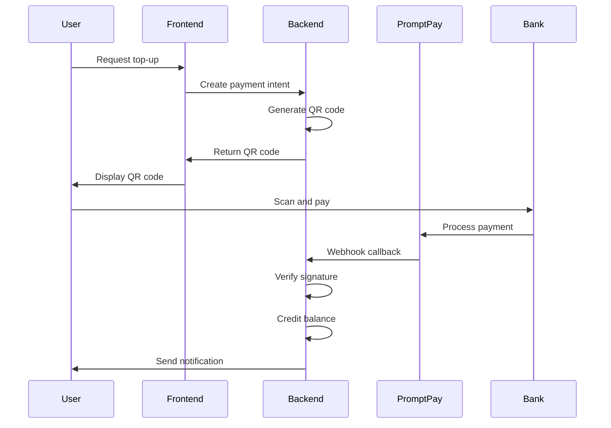
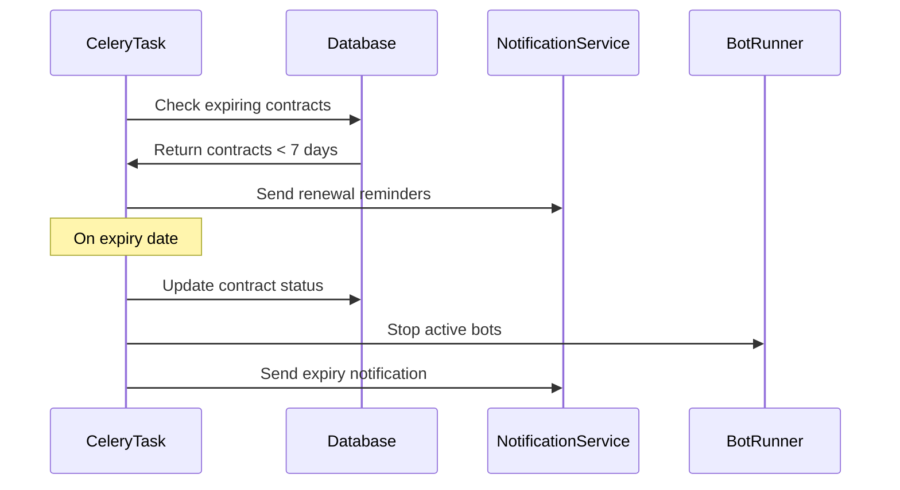
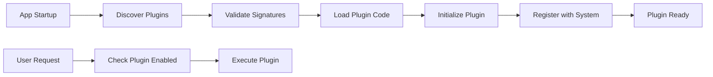
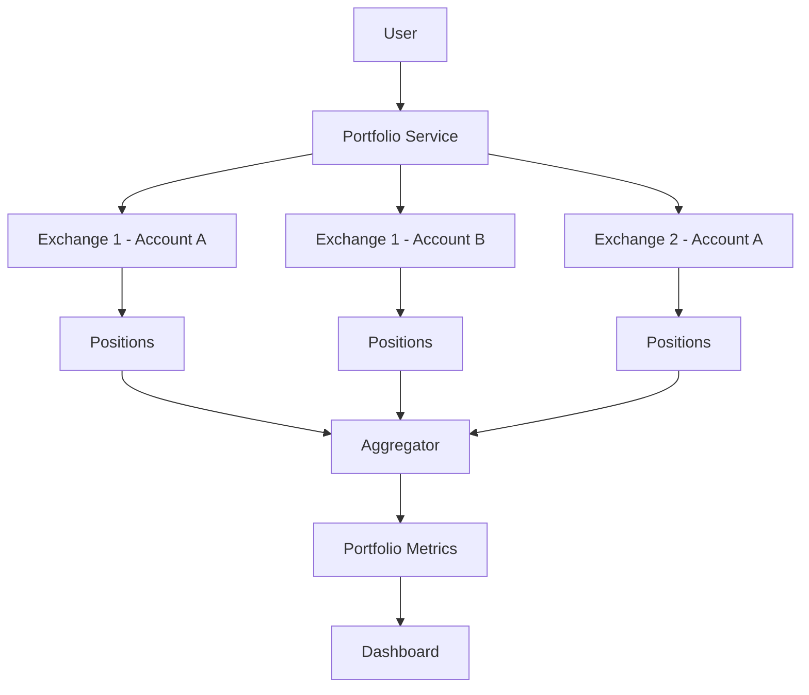

# สรุปการดำเนินงาน เฟส 4 (Phase 4)

### Quick Links
- [Phase 4 Guide](PHASE4_GUIDE.md)
- [Phase 3 Summary](PHASE3_SUMMARY.md)
- [Roadmap](ROADMAP.md)

## Phase 4 Objectives

Phase 4 focuses on monetization features, advanced portfolio management, and comprehensive backtesting capabilities. This phase transforms the platform into a commercial-grade solution with revenue generation, multi-account portfolio tracking, and risk-free testing environments.

## Planned Features

### 💰 1. PromptPay Top-up Flow (QR / Callback)

#### Implementation Plan
- **QR Code Generation**: Generate PromptPay QR codes for Thai Baht top-ups
- **Payment Gateway Integration**: Connect with Thai payment processors
- **Webhook Callbacks**: Handle payment confirmation callbacks
- **Balance Management**: Track user credits and wallet balances
- **Transaction History**: Complete audit trail of all top-ups

#### Technical Components
- PromptPay QR code generator (Thai National QR standard)
- Payment webhook receiver with signature validation
- Credit balance tracking system
- Transaction logging and reconciliation
- Email/Telegram notifications for successful payments

#### Files to Create/Modify
- `apps/backend/src/services/promptpay_service.py` - PromptPay QR generation
- `apps/backend/src/services/payment_service.py` - Payment processing logic
- `apps/backend/src/api/payment_endpoints.py` - Payment API routes
- `apps/backend/prisma/schema.prisma` - Add Wallet and Transaction models
- `apps/frontend/src/components/payment/PromptPayTopup.tsx` - QR display component
- `apps/frontend/src/components/payment/TransactionHistory.tsx` - Transaction list

### 📋 2. Rental Contract Expiry Enforcement

#### Implementation Plan
- **Expiry Monitoring**: Background job to check contract expiration
- **Grace Period**: Configurable grace period before enforcement
- **Auto-Disable**: Automatically disable expired accounts
- **Renewal Reminders**: Notify users before expiry
- **Access Control**: Enforce feature access based on contract status

#### Enforcement Features
- Daily scheduled task to check all contracts
- Email/Telegram notifications (7 days, 3 days, 1 day before expiry)
- Automatic bot stop on expiry
- API access restriction for expired contracts
- Self-service renewal flow

#### Technical Components
- Celery scheduled task for expiry checking
- Contract status middleware for API endpoints
- Feature flag system based on contract tier
- Notification templates for renewal reminders
- Admin dashboard for contract management

#### Files to Create/Modify
- `apps/backend/src/services/rental_service.py` - Contract management
- `apps/backend/src/worker/tasks.py` - Add expiry check task
- `apps/backend/src/middleware/contract_guard.py` - Access control middleware
- `apps/backend/src/api/rental_endpoints.py` - Contract API routes
- `apps/frontend/src/components/subscription/RentalStatus.tsx` - Status display
- `apps/frontend/src/components/subscription/RenewalFlow.tsx` - Renewal UI

### 🔌 3. Module Plugin Loader (Entry Point)

#### Implementation Plan
- **Plugin Architecture**: Define plugin interface and lifecycle
- **Entry Point Discovery**: Python entry_points for plugin registration
- **Dynamic Loading**: Load plugins at runtime
- **Plugin Marketplace**: UI to browse and enable/disable plugins
- **Security**: Sandbox plugins and validate signatures

#### Plugin Features
- Strategy plugins (custom trading strategies)
- Indicator plugins (custom technical indicators)
- Notification plugins (custom alert channels)
- Data source plugins (alternative market data)
- UI component plugins (dashboard widgets)

#### Technical Components
- Plugin base class and interface definition
- Plugin registry and discovery system
- Plugin lifecycle management (load, init, start, stop)
- Plugin configuration storage
- Plugin permissions and capability system

#### Files to Create/Modify
- `apps/backend/src/plugins/plugin_interface.py` - Base plugin class
- `apps/backend/src/plugins/plugin_loader.py` - Plugin discovery and loading
- `apps/backend/src/plugins/plugin_registry.py` - Plugin registry
- `apps/backend/src/api/plugin_endpoints.py` - Plugin management API
- `apps/backend/setup.py` - Entry point configuration
- `apps/frontend/src/components/plugins/PluginMarketplace.tsx` - Plugin UI
- Example plugins in `plugins/` directory

### 📊 4. Portfolio Aggregation / Multi-Account

#### Implementation Plan
- **Multiple Exchanges**: Support multiple accounts per exchange
- **Unified Portfolio View**: Aggregate positions across all accounts
- **Cross-Account Analytics**: Combined PnL, risk metrics
- **Account Grouping**: Organize accounts by strategy or purpose
- **Real-time Sync**: Keep portfolio data synchronized

#### Portfolio Features
- Add multiple API keys per user per exchange
- Consolidated portfolio dashboard showing all positions
- Aggregate profit/loss calculations
- Total exposure and risk metrics
- Account-level and portfolio-level performance tracking

#### Technical Components
- Multi-account key management
- Portfolio aggregation service
- Real-time position synchronization
- Cross-account PnL calculator
- Portfolio analytics engine

#### Files to Create/Modify
- `apps/backend/src/services/portfolio_service.py` - Portfolio aggregation
- `apps/backend/src/api/portfolio_endpoints.py` - Portfolio API
- `apps/backend/prisma/schema.prisma` - Extend ExchangeKey with account labels
- `apps/frontend/src/components/portfolio/AggregatedView.tsx` - Portfolio dashboard
- `apps/frontend/src/components/portfolio/AccountManager.tsx` - Account management

### 🧪 5. Backtester / Paper Trading Mode

#### Implementation Plan
- **Historical Backtesting**: Test strategies on historical data
- **Paper Trading**: Live simulation without real money
- **Performance Metrics**: Comprehensive backtest results
- **Strategy Optimization**: Parameter tuning and analysis
- **Walk-Forward Testing**: Advanced validation techniques

#### Backtesting Features
- Historical data download and storage
- Strategy execution simulation
- Slippage and commission modeling
- Trade-by-trade replay
- Performance reports (Sharpe ratio, max drawdown, win rate)
- Equity curve visualization

#### Paper Trading Features
- Live market data with simulated execution
- Virtual portfolio with fake balance
- Real-time strategy testing
- Zero-risk validation environment
- Seamless transition to live trading

#### Technical Components
- Historical data downloader and storage
- Backtesting engine with event-driven simulation
- Performance calculator and metrics
- Paper trading execution simulator
- Visualization components for results

#### Files to Create/Modify
- `apps/backend/src/backtesting/backtest_engine.py` - Core backtesting logic
- `apps/backend/src/backtesting/data_loader.py` - Historical data management
- `apps/backend/src/backtesting/performance_metrics.py` - Metrics calculator
- `apps/backend/src/services/paper_trading_service.py` - Paper trading simulator
- `apps/backend/src/api/backtest_endpoints.py` - Backtesting API
- `apps/frontend/src/components/backtest/BacktestRunner.tsx` - Backtest UI
- `apps/frontend/src/components/backtest/ResultsViewer.tsx` - Results display

## Technical Architecture

### Payment Processing Flow


### Rental Contract Enforcement Flow


### Plugin Loading Flow


### Portfolio Aggregation Architecture


## Database Schema Extensions

### Payment & Wallet System
```prisma
model Wallet {
  id        Int      @id @default(autoincrement())
  userId    Int      @unique
  user      User     @relation(fields: [userId], references: [id])
  balance   Float    @default(0)
  currency  String   @default("THB")
  createdAt DateTime @default(now())
  updatedAt DateTime @updatedAt
}

model Transaction {
  id              Int      @id @default(autoincrement())
  userId          Int
  user            User     @relation(fields: [userId], references: [id])
  type            String   // TOP_UP, DEDUCTION, REFUND
  amount          Float
  currency        String   @default("THB")
  status          String   @default("PENDING")
  paymentMethod   String?  // PROMPTPAY, CREDIT_CARD
  referenceId     String?  @unique
  metadata        String?  // JSON for additional data
  createdAt       DateTime @default(now())
  completedAt     DateTime?
}
```

### Extended Rental Contract
```prisma
model RentalContract {
  id              Int      @id @default(autoincrement())
  userId          Int
  user            User     @relation(fields: [userId], references: [id])
  plan            String   // BASIC, PREMIUM, ENTERPRISE
  expiry          DateTime
  status          String   @default("ACTIVE") // ACTIVE, EXPIRED, SUSPENDED
  gracePeriodDays Int      @default(3)
  autoRenew       Boolean  @default(false)
  features        String?  // JSON array of enabled features
  createdAt       DateTime @default(now())
  renewedAt       DateTime?
}
```

### Plugin System
```prisma
model Plugin {
  id           Int      @id @default(autoincrement())
  name         String   @unique
  version      String
  type         String   // STRATEGY, INDICATOR, NOTIFICATION, DATASOURCE
  entryPoint   String
  author       String?
  description  String?
  verified     Boolean  @default(false)
  createdAt    DateTime @default(now())
  updatedAt    DateTime @updatedAt
}

model UserPlugin {
  id         Int      @id @default(autoincrement())
  userId     Int
  user       User     @relation(fields: [userId], references: [id])
  pluginId   Int
  plugin     Plugin   @relation(fields: [pluginId], references: [id])
  enabled    Boolean  @default(false)
  config     String?  // JSON configuration
  createdAt  DateTime @default(now())
  
  @@unique([userId, pluginId])
}
```

### Multi-Account Portfolio
```prisma
model Account {
  id            Int      @id @default(autoincrement())
  userId        Int
  user          User     @relation(fields: [userId], references: [id])
  exchangeKeyId Int
  exchangeKey   ExchangeKey @relation(fields: [exchangeKeyId], references: [id])
  label         String   // User-defined label for account
  group         String?  // Optional grouping
  enabled       Boolean  @default(true)
  createdAt     DateTime @default(now())
}

model Position {
  id        Int      @id @default(autoincrement())
  accountId Int
  account   Account  @relation(fields: [accountId], references: [id])
  symbol    String
  side      String   // LONG, SHORT
  quantity  Float
  entryPrice Float
  currentPrice Float?
  pnl       Float    @default(0)
  updatedAt DateTime @updatedAt
  
  @@unique([accountId, symbol])
}
```

### Backtesting
```prisma
model BacktestRun {
  id           Int      @id @default(autoincrement())
  userId       Int
  user         User     @relation(fields: [userId], references: [id])
  strategyName String
  symbol       String
  timeframe    String
  startDate    DateTime
  endDate      DateTime
  initialCapital Float
  status       String   @default("PENDING") // PENDING, RUNNING, COMPLETED, FAILED
  results      String?  // JSON with metrics
  createdAt    DateTime @default(now())
  completedAt  DateTime?
}

model PaperTradingSession {
  id             Int      @id @default(autoincrement())
  userId         Int
  user           User     @relation(fields: [userId], references: [id])
  strategyName   String
  symbol         String
  timeframe      String
  virtualBalance Float    @default(10000)
  currentBalance Float?
  status         String   @default("ACTIVE")
  startedAt      DateTime @default(now())
  stoppedAt      DateTime?
}
```

## API Endpoints Summary

### Payment (`/payment`)
- `POST /payment/promptpay/create` - Generate PromptPay QR code
- `POST /payment/webhook/promptpay` - Handle payment callbacks
- `GET /payment/transactions` - Get transaction history
- `GET /payment/wallet` - Get wallet balance

### Rental (`/rental`)
- `GET /rental/contract` - Get user's contract details
- `POST /rental/renew` - Renew contract
- `GET /rental/plans` - List available plans
- `GET /rental/features` - Get enabled features for current contract

### Plugins (`/plugins`)
- `GET /plugins/available` - List all available plugins
- `GET /plugins/installed` - List user's installed plugins
- `POST /plugins/install` - Install a plugin
- `DELETE /plugins/uninstall/:id` - Uninstall a plugin
- `PUT /plugins/:id/config` - Update plugin configuration
- `POST /plugins/:id/toggle` - Enable/disable plugin

### Portfolio (`/portfolio`)
- `GET /portfolio/summary` - Get aggregated portfolio summary
- `GET /portfolio/accounts` - List all accounts
- `POST /portfolio/accounts` - Add new account
- `DELETE /portfolio/accounts/:id` - Remove account
- `GET /portfolio/positions` - Get all positions across accounts
- `GET /portfolio/performance` - Get portfolio performance metrics

### Backtesting (`/backtest`)
- `POST /backtest/run` - Start a backtest
- `GET /backtest/runs` - List backtest runs
- `GET /backtest/runs/:id` - Get backtest results
- `DELETE /backtest/runs/:id` - Delete backtest run
- `POST /backtest/paper/start` - Start paper trading session
- `POST /backtest/paper/stop` - Stop paper trading session
- `GET /backtest/paper/status` - Get paper trading status

## Dependencies

### Backend
```txt
# PromptPay
qrcode==7.4.2
pillow==10.1.0
promptpay==1.0.0

# Plugin System
pluggy==1.3.0
importlib-metadata==6.8.0

# Backtesting
backtrader==1.9.78.123
pandas==2.1.3
numpy==1.26.2
```

### Frontend
```json
{
  "dependencies": {
    "qrcode.react": "^3.1.0",
    "recharts": "^2.10.0",
    "date-fns": "^2.30.0"
  }
}
```

## Testing Strategy

### Unit Tests
- PromptPay QR code generation and validation
- Contract expiry calculation logic
- Plugin loading and validation
- Portfolio aggregation calculations
- Backtest performance metrics

### Integration Tests
- Complete payment flow (QR generation to callback)
- Contract expiry enforcement workflow
- Plugin installation and execution
- Multi-account position synchronization
- Backtest execution from start to finish

### End-to-End Tests
- User top-up via PromptPay
- Contract renewal process
- Plugin marketplace browsing and installation
- Portfolio dashboard with multiple accounts
- Running a backtest and viewing results

## Security Considerations

### Payment Security
- ✅ Validate webhook signatures from payment gateway
- ✅ Use HTTPS for all payment callbacks
- ✅ Implement idempotency for payment processing
- ✅ Log all payment transactions for audit
- ✅ Rate limit payment endpoints

### Plugin Security
- ✅ Verify plugin signatures before loading
- ✅ Sandbox plugin execution (resource limits)
- ✅ Restrict plugin API access (capability system)
- ✅ Review plugins before marketplace listing
- ✅ Monitor plugin behavior for anomalies

### Data Security
- ✅ Encrypt sensitive plugin configuration
- ✅ Secure multi-account API key storage
- ✅ Implement role-based access control for admin features
- ✅ Audit log for all financial transactions
- ✅ Regular security scans of plugin code

## Performance Considerations

### Payment Processing
- Queue payment webhooks via Celery
- Implement webhook retry logic
- Cache QR codes for duplicate requests
- Index transaction tables for fast lookups

### Portfolio Aggregation
- Cache portfolio calculations (5-minute TTL)
- Use database views for complex aggregations
- Implement pagination for large portfolios
- Background job for position synchronization

### Backtesting
- Limit concurrent backtest runs per user
- Stream large result sets instead of loading all
- Cache historical data for popular symbols
- Implement progress tracking for long-running backtests

## Success Metrics

### Business Metrics
- Monthly recurring revenue (MRR) from subscriptions
- Top-up conversion rate > 60%
- Contract renewal rate > 80%
- Plugin marketplace engagement > 30% of users

### Technical Metrics
- Payment processing success rate > 99%
- Contract check execution time < 1 second
- Plugin load time < 500ms
- Portfolio aggregation response < 2 seconds
- Backtest completion for 1-year data < 5 minutes

### Quality Metrics
- Zero payment processing errors
- Zero unauthorized plugin executions
- 100% contract expiry enforcement accuracy
- < 0.1% portfolio calculation discrepancies

## Documentation Updates

### Files to Create
- ✅ `PHASE4_SUMMARY.md` - This summary document
- ✅ `PHASE4_GUIDE.md` - Implementation guide
- `PHASE4_IMPLEMENTATION_SUMMARY.md` - Post-implementation summary

### Files to Update
- ✅ `README.md` - Add Phase 4 documentation links
- ✅ `ROADMAP.md` - Mark Phase 4 as in progress
- `SECURITY.md` - Add payment and plugin security policies
- `CONTRIBUTING.md` - Add plugin development guidelines

## Implementation Timeline

### Week 1-2: PromptPay Integration
- Set up payment gateway account
- Implement QR code generation
- Create webhook handler
- Build top-up UI
- Test payment flow

### Week 3-4: Rental Enforcement
- Implement expiry checking task
- Create access control middleware
- Build renewal flow
- Set up notification templates
- Test enforcement logic

### Week 5-6: Plugin System
- Design plugin interface
- Implement plugin loader
- Create example plugins
- Build plugin marketplace UI
- Test plugin security

### Week 7-8: Portfolio Aggregation
- Extend multi-account support
- Implement aggregation service
- Build portfolio dashboard
- Create performance analytics
- Test with multiple exchanges

### Week 9-10: Backtesting
- Implement backtest engine
- Create data loader for historical data
- Build performance calculator
- Design results viewer UI
- Test with various strategies

### Week 11-12: Integration & Polish
- Integration testing all features
- Performance optimization
- Security audit
- Documentation completion
- User acceptance testing

## Conclusion

Phase 4 represents a major milestone in transforming ABTPro into a commercial-grade platform with revenue generation capabilities, advanced portfolio management, and comprehensive testing tools.

The combination of these features will:
- Generate sustainable revenue through subscriptions and top-ups
- Provide professional-grade portfolio management
- Enable risk-free strategy development and testing
- Support extensibility through plugin system
- Enforce business rules through contract management

Upon completion, Phase 4 will establish ABTPro as a complete, production-ready trading platform ready for Phase 5's compliance and audit enhancements.
