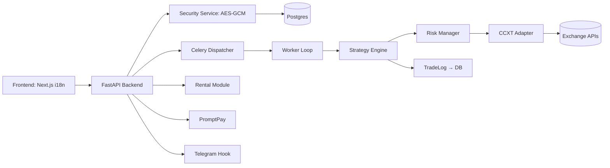

# ZeaZDev-ABTPro-i18n

แพลตฟอร์ม Auto Bot Trader ระดับ Production รองรับหลายภาษา (i18n) และหลายกลยุทธ์ (Multi-Strategy) บนหลาย Exchange (Multi-Exchange) พร้อมระบบความปลอดภัยสำหรับ API Key (AES-GCM) และส่วนขยายทางธุรกิจ (Rental, PromptPay Top-up, Module Plugin)

## คุณสมบัติหลัก
- FastAPI Backend + Celery Worker Loop
- Next.js Frontend (App Router) + react-i18next
- เข้ารหัส API Key ทันที (AES-GCM)
- Strategy Engine แบบ Plug-in (RSI Cross ตัวอย่าง Production)
- Prisma Schema สำหรับ Postgres
- ระบบเช่า (Rental Contract), เติมเงิน (PromptPay), โมดูล (ModuleRegistration)
- รองรับการเพิ่ม OAuth Google / Telegram (Roadmap)

## สถาปัตยกรรม

## Tech Stack
- Frontend: Next.js + react-i18next
- Backend: FastAPI + Prisma Client (Python) + CCXT
- DB: Postgres
- Queue: Celery + Redis
- Security: AES-GCM encryption service
- Deployment: Docker Compose

## การติดตั้ง (ย่อ)
1. สร้างไฟล์ `.env` (หรือใช้ `install.sh`)
2. รัน `./install.sh`
3. เข้าใช้งาน Frontend: http://localhost:3000/en/dashboard

## การใช้งานเบื้องต้น
- เพิ่ม API Key: หน้า Settings → บันทึก → ส่งไปที่ `/exchange/keys`
- เริ่มบอท: Dashboard → Start Bot (เรียก `/bot/start`)
- ดู PnL: Dashboard ดึง `/dashboard/pnl`

## ความปลอดภัย
ดูไฟล์ [SECURITY.md](SECURITY.md)

## กลยุทธ์
เพิ่มไฟล์ใหม่ใน `src/trading/strategies/` แล้ว `StrategyRegistry.register(YourStrategyClass)`

## Roadmap
ดูไฟล์ [ROADMAP.md](ROADMAP.md)

## การตั้งค่า GitHub
ดูไฟล์ [GITHUB-SETUP.md](GITHUB-SETUP.md)

## Installer
ดูไฟล์ `install.sh` และเอกสารระบบปฏิบัติการใน `INSTALLER_PLATFORM_REQUIREMENTS.md`
