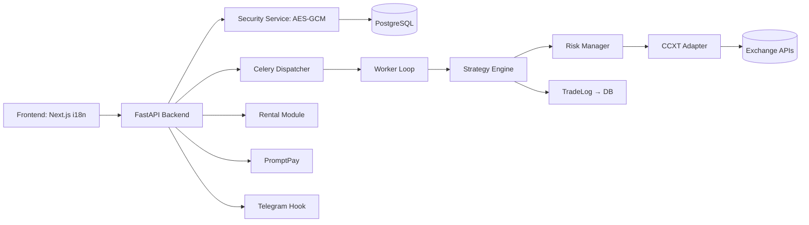

# Auto Bot Trader Pro (ABTPro) i18n

<div align="center">

[](CHANGELOG.md)
[](LICENSE)
[](https://www.python.org/)
[](https://nodejs.org/)

**Production-ready automated trading platform with multi-language support, multi-strategy execution, and multi-exchange connectivity**

[Features](#-features) • [Quick Start](#-quick-start) • [Documentation](#-documentation) • [Architecture](#-architecture) • [Contributing](docs/guides/CONTRIBUTING.md)

</div>

---

## 📖 About

ABTPro i18n is a comprehensive automated trading platform designed for professional cryptocurrency trading. Built with security, scalability, and flexibility in mind, it provides a complete solution for deploying and managing trading strategies across multiple exchanges.

**Key Capabilities:**
- 🔐 **Enterprise Security**: AES-GCM encryption for API keys, OAuth 2.0 authentication
- 🌍 **Multi-Language**: Support for Thai, English, Chinese, and Japanese
- 📊 **Multi-Strategy**: Pluggable strategy architecture with backtesting and paper trading
- 💱 **Multi-Exchange**: CCXT-based connectivity to multiple cryptocurrency exchanges
- 🔔 **Notifications**: Telegram bot integration for real-time alerts
- 💰 **Monetization**: Built-in rental system and PromptPay payment integration
- 🤖 **ML-Powered**: Machine learning signal scoring and reinforcement learning tuning

## ✨ Features

### Core Trading Platform
- **FastAPI Backend** with Celery worker loops for distributed task execution
- **Next.js Frontend** with App Router and react-i18next for seamless i18n
- **Strategy Engine** with plug-in architecture (includes RSI Cross, Mean Reversion, Breakout, VWAP)
- **TradingView Integration** with webhook support for external alerts and strategies
- **Risk Management** with max drawdown tracking and circuit breakers
- **Real-time Market Data** via WebSocket streaming

### Security & Compliance
- **API Key Encryption**: Immediate AES-GCM encryption for all exchange credentials
- **Google OAuth 2.0**: Secure user authentication
- **Audit Trail System**: Complete logging of all API actions
- **Static Code Scanning**: Automated security checks with Bandit and Semgrep
- **Secret Rotation**: Automated credential rotation workflow
- **DR/Failover Strategy**: Multi-region disaster recovery planning

### Business Features
- **Rental Contracts**: Subscription-based access control with expiry enforcement
- **PromptPay Integration**: QR code payment processing with callbacks
- **Module Plugin Loader**: Dynamic loading of custom trading modules
- **Portfolio Aggregation**: Multi-account portfolio management
- **Backtesting & Paper Trading**: Test strategies without risking capital

### Intelligence & Analytics
- **ML Signal Quality Scoring**: Evaluate trading signals with machine learning
- **Reinforcement Learning**: Strategy parameter optimization
- **Predictive Volatility**: Volatility estimation for better risk management
- **Prometheus & Grafana**: Comprehensive monitoring and metrics

## 🏗 Architecture



### Component Overview

| Component | Technology | Purpose |
|-----------|-----------|---------|
| **Frontend** | Next.js + react-i18next | Multi-language dashboard with App Router |
| **Backend** | FastAPI + Prisma | REST API with ORM for PostgreSQL |
| **Worker** | Celery + Redis | Distributed task queue for trading loops |
| **Database** | PostgreSQL | Persistent storage for users, trades, and configs |
| **Security** | AES-GCM | API key encryption service |
| **Auth** | Google OAuth 2.0 | User authentication and authorization |
| **Notifications** | Telegram Bot API | Real-time trade alerts and notifications |
| **Monitoring** | Prometheus + Grafana | Metrics collection and visualization |
| **Deployment** | Docker Compose | Multi-container orchestration |

## 🚀 Quick Start

### Prerequisites
- Docker & Docker Compose
- Python 3.11+
- Node.js 18+
- PostgreSQL 14+
- Redis 7+

### Installation

1. **Clone the repository**
   ```bash
   git clone https://github.com/ZeaZDev/ABTPi18n.git
   cd ABTPi18n
   ```

2. **Set up environment variables**
   ```bash
   cp .env.example .env
   # Edit .env with your configuration
   ```

3. **Run the installation script**
   ```bash
   ./install.sh
   ```

4. **Access the application**
   - Frontend: http://localhost:3000/en/dashboard
   - Backend API: http://localhost:8000/docs
   - Monitoring: http://localhost:9090 (Prometheus) / http://localhost:3001 (Grafana)

### First Steps

1. **Sign in**: Navigate to http://localhost:3000/en/login and sign in with Google
2. **Add API Keys**: Go to Settings → Exchange Keys → Add your exchange API credentials
3. **Connect Telegram**: Settings → Telegram Integration → Link your account
4. **Customize Theme**: Settings → Theme Customizer → Choose colors and mode
5. **Select Language**: Use the language selector (🇬🇧 🇹🇭 🇨🇳 🇯🇵)
6. **Start Trading**: Dashboard → Configure Strategy → Start Bot
7. **Monitor Performance**: View real-time PnL and trade history on the Dashboard

## 💻 Usage

### Starting a Trading Bot

```python
# Example: Configure and start a trading bot via API
POST /bot/start
{
  "strategy": "RSI_CROSS",
  "exchange": "binance",
  "symbol": "BTC/USDT",
  "parameters": {
    "rsi_period": 14,
    "oversold": 30,
    "overbought": 70
  }
}
```

### Developing Custom Strategies

Add new strategy files to `apps/backend/src/trading/strategies/` and register them:

```python
from src.trading.strategies.base import BaseStrategy

class MyCustomStrategy(BaseStrategy):
    def analyze(self, market_data):
        # Your strategy logic here
        pass
    
    def execute(self, signal):
        # Execute trades based on signals
        pass

# Register the strategy
StrategyRegistry.register(MyCustomStrategy)
```

See the [Strategy Development Guide](docs/strategy/STRATEGY_GUIDE.md) for detailed instructions.

## 📚 Documentation

All documentation is organized in the [`docs/`](docs/) directory.

### Core Documentation
- **[Contributing Guide](docs/guides/CONTRIBUTING.md)** - Development setup and workflow
- **[Roadmap](docs/guides/ROADMAP.md)** - Project phases and progress
- **[Security Guide](docs/guides/SECURITY.md)** - Security model and best practices
- **[Release Process](docs/guides/RELEASE.md)** - Creating releases and publishing packages

### Setup & Configuration
- [GitHub Setup](docs/setup/GITHUB-SETUP.md) - Configuring GitHub Secrets
- [Platform Requirements](docs/setup/INSTALLER_PLATFORM_REQUIREMENTS.md) - System requirements
- [TradingView Integration](docs/integrations/TRADINGVIEW_INTEGRATION.md) - Connect TradingView alerts

### Strategy Development & DR
- [Strategy Guide](docs/strategy/STRATEGY_GUIDE.md) - Building trading strategies
- [DR/Failover Strategy](docs/strategy/DR_FAILOVER_STRATEGY.md) - Disaster recovery planning

### Phase Documentation
- **Phase 1** (Foundation): [Guide](docs/phases/phase1/PHASE1_GUIDE.md) | [Summary](docs/phases/phase1/PHASE1_SUMMARY.md) | [Implementation](docs/phases/phase1/PHASE1_IMPLEMENTATION_SUMMARY.md)
- **Phase 2** (Strategy Engine): [Guide](docs/phases/phase2/PHASE2_GUIDE.md) | [Summary](docs/phases/phase2/PHASE2_SUMMARY.md) | [Implementation](docs/phases/phase2/PHASE2_IMPLEMENTATION_SUMMARY.md)
- **Phase 3** (i18n & Auth): [Guide](docs/phases/phase3/PHASE3_GUIDE.md) | [Summary](docs/phases/phase3/PHASE3_SUMMARY.md) | [Implementation](docs/phases/phase3/PHASE3_IMPLEMENTATION_SUMMARY.md)
- **Phase 4** (Monetization): [Guide](docs/phases/phase4/PHASE4_GUIDE.md) | [Summary](docs/phases/phase4/PHASE4_SUMMARY.md) | [Implementation](docs/phases/phase4/PHASE4_IMPLEMENTATION_SUMMARY.md)
- **Phase 5** (Compliance): [Guide](docs/phases/phase5/PHASE5_GUIDE.md) | [Summary](docs/phases/phase5/PHASE5_SUMMARY.md) | [Implementation](docs/phases/phase5/PHASE5_IMPLEMENTATION_SUMMARY.md) | [Quick Start](docs/phases/phase5/PHASE5_QUICK_START.md) | [Migration](docs/phases/phase5/PHASE5_MIGRATION_GUIDE.md)
- **Phase 6** (ML/Intelligence): [Guide](docs/phases/phase6/PHASE6_GUIDE.md) | [Summary](docs/phases/phase6/PHASE6_SUMMARY.md) | [Implementation](docs/phases/phase6/PHASE6_IMPLEMENTATION_SUMMARY.md) | [Quick Start](docs/phases/phase6/PHASE6_QUICK_START.md)

📖 **[View Complete Documentation Index](docs/README.md)**

## 🔒 Security

Security is a top priority for ABTPro. Key security features include:

- **API Key Encryption**: All exchange API keys are encrypted using AES-GCM before storage
- **OAuth 2.0**: Secure user authentication via Google
- **Audit Logging**: Complete audit trail of all API actions
- **Static Analysis**: Automated security scanning with Bandit and Semgrep
- **Secret Rotation**: Automated credential rotation mechanisms
- **CodeQL**: Continuous security vulnerability scanning

For detailed security information, see [SECURITY.md](docs/guides/SECURITY.md).

## 🚢 Releases

**Current Version**: 1.0.0 - [View Release Notes](CHANGELOG.md)

### Creating a New Release

```bash
./release.sh <version>
# Example: ./release.sh 1.1.0
```

See the [Release Guide](docs/guides/RELEASE.md) for detailed instructions.

## 🤝 Contributing

We welcome contributions! Please see our [Contributing Guide](docs/guides/CONTRIBUTING.md) for details on:

- Development environment setup
- Code style and standards
- Pull request process
- Testing requirements

## 📄 License

This project is licensed under the MIT License - see the [LICENSE](LICENSE) file for details.

## 🌟 Acknowledgments

Built with:
- [FastAPI](https://fastapi.tiangolo.com/) - Modern Python web framework
- [Next.js](https://nextjs.org/) - React framework for production
- [CCXT](https://github.com/ccxt/ccxt) - Cryptocurrency exchange library
- [Prisma](https://www.prisma.io/) - Next-generation ORM
- [Celery](https://docs.celeryq.dev/) - Distributed task queue

## 📞 Support

For issues, questions, or feature requests:
- Open an issue on [GitHub Issues](https://github.com/ZeaZDev/ABTPi18n/issues)
- Check the [documentation](docs/README.md)
- Review the [FAQ](docs/guides/CONTRIBUTING.md#faq) (if available)

---

<div align="center">

**Made with ❤️ by ZeaZDev**

[Website](https://zeazdev.com) • [Documentation](docs/README.md) • [Changelog](CHANGELOG.md)

</div>
