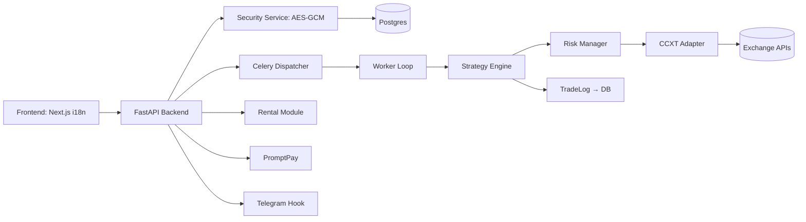

# ZeaZDev-ABTPro-i18n

แพลตฟอร์ม Auto Bot Trader ระดับ Production รองรับหลายภาษา (i18n) และหลายกลยุทธ์ (Multi-Strategy) บนหลาย Exchange (Multi-Exchange) พร้อมระบบความปลอดภัยสำหรับ API Key (AES-GCM) และส่วนขยายทางธุรกิจ (Rental, PromptPay Top-up, Module Plugin)

## 🚀 Latest Release

**Version 1.0.0** - [View Release Notes](CHANGELOG.md) | [Release Guide](docs/guides/RELEASE.md)

To create a new release:
```bash
./release.sh 1.0.0
```

## คุณสมบัติหลัก
- FastAPI Backend + Celery Worker Loop
- Next.js Frontend (App Router) + react-i18next
- เข้ารหัส API Key ทันที (AES-GCM)
- Strategy Engine แบบ Plug-in (RSI Cross ตัวอย่าง Production)
- Prisma Schema สำหรับ Postgres
- ระบบเช่า (Rental Contract), เติมเงิน (PromptPay), โมดูล (ModuleRegistration)
- **Phase 3 (DONE ✅):** Google OAuth Authentication, Telegram Notifications, Dynamic Themes, Multi-language Support (Thai, English, Chinese, Japanese)
- **Phase 4 (DONE ✅):** PromptPay Top-up Flow, Rental Expiry Enforcement, Plugin Loader, Portfolio Aggregation, Backtester & Paper Trading
- **Phase 5 (DONE ✅):** Audit Trail System, Static Code Scanning (Bandit/Semgrep), Secret Rotation Flow, DR/Failover Strategy
- **Phase 6 (DONE ✅):** ML Signal Quality Scoring, Reinforcement Learning Strategy Tuning, Predictive Volatility Estimation

## สถาปัตยกรรม


## Tech Stack
- Frontend: Next.js + react-i18next + Theme System
- Backend: FastAPI + Prisma Client (Python) + CCXT
- DB: Postgres
- Queue: Celery + Redis
- Security: AES-GCM encryption service
- Authentication: Google OAuth 2.0
- Notifications: Telegram Bot API
- Deployment: Docker Compose

## การติดตั้ง (ย่อ)
1. สร้างไฟล์ `.env` (หรือใช้ `install.sh`)
2. รัน `./install.sh`
3. เข้าใช้งาน Frontend: http://localhost:3000/en/dashboard

## การใช้งานเบื้องต้น
- เข้าสู่ระบบ: http://localhost:3000/en/login → Sign in with Google
- เพิ่ม API Key: หน้า Settings → บันทึก → ส่งไปที่ `/exchange/keys`
- เชื่อมต่อ Telegram: Settings → Telegram Integration → Link Account
- ปรับแต่งธีม: Settings → Theme Customizer → เลือกสี/โหมด
- เปลี่ยนภาษา: ใช้ Language Selector (🇬🇧 🇹🇭 🇨🇳 🇯🇵)
- เริ่มบอท: Dashboard → Start Bot (เรียก `/bot/start`)
- ดู PnL: Dashboard ดึง `/dashboard/pnl`

## ความปลอดภัย
ดูไฟล์ [SECURITY.md](docs/guides/SECURITY.md)

## กลยุทธ์
เพิ่มไฟล์ใหม่ใน `src/trading/strategies/` แล้ว `StrategyRegistry.register(YourStrategyClass)`  
ดูคู่มือการพัฒนากลยุทธ์ที่ [STRATEGY_GUIDE.md](docs/strategy/STRATEGY_GUIDE.md)

## 📚 เอกสาร (Documentation)

เอกสารทั้งหมดได้จัดระเบียบไว้ในโฟลเดอร์ [`docs/`](docs/) แล้ว  
👉 **[ดูเอกสารทั้งหมด](docs/README.md)**

### เอกสารหลัก
- [คู่มือการพัฒนา (Contributing)](docs/guides/CONTRIBUTING.md) — Development setup and workflow
- [แผนงาน (Roadmap)](docs/guides/ROADMAP.md) — สถานะและแผนงานทั้งหมด
- [ความปลอดภัย (Security)](docs/guides/SECURITY.md) — Security model และ best practices
- [Release Process](docs/guides/RELEASE.md) — How to create releases and publish packages

### การติดตั้งและตั้งค่า
- [GitHub Setup](docs/setup/GITHUB-SETUP.md) — การตั้งค่า GitHub Secrets
- [Platform Requirements](docs/setup/INSTALLER_PLATFORM_REQUIREMENTS.md) — ข้อกำหนดระบบปฏิบัติการ

### กลยุทธ์และ DR
- [Strategy Guide](docs/strategy/STRATEGY_GUIDE.md) — คู่มือการพัฒนากลยุทธ์
- [DR/Failover Strategy](docs/strategy/DR_FAILOVER_STRATEGY.md) — กลยุทธ์การกู้คืนจากภัยพิบัติ

### เอกสารแต่ละ Phase
- **Phase 1** (Foundation): [Guide](docs/phases/phase1/PHASE1_GUIDE.md) | [Summary](docs/phases/phase1/PHASE1_SUMMARY.md) | [Implementation](docs/phases/phase1/PHASE1_IMPLEMENTATION_SUMMARY.md)
- **Phase 2** (Strategy Engine): [Guide](docs/phases/phase2/PHASE2_GUIDE.md) | [Summary](docs/phases/phase2/PHASE2_SUMMARY.md) | [Implementation](docs/phases/phase2/PHASE2_IMPLEMENTATION_SUMMARY.md)
- **Phase 6** (ML/Intelligence): [Guide](docs/phases/phase6/PHASE6_GUIDE.md) | [Summary](docs/phases/phase6/PHASE6_SUMMARY.md) | [Implementation](docs/phases/phase6/PHASE6_IMPLEMENTATION_SUMMARY.md) | [Quick Start](docs/phases/phase6/PHASE6_QUICK_START.md)
- **Phase 5** (Compliance): [Guide](docs/phases/phase5/PHASE5_GUIDE.md) | [Summary](docs/phases/phase5/PHASE5_SUMMARY.md) | [Implementation](docs/phases/phase5/PHASE5_IMPLEMENTATION_SUMMARY.md) | [Quick Start](docs/phases/phase5/PHASE5_QUICK_START.md) | [Migration](docs/phases/phase5/PHASE5_MIGRATION_GUIDE.md)
- **Phase 4** (Monetization): [Guide](docs/phases/phase4/PHASE4_GUIDE.md) | [Summary](docs/phases/phase4/PHASE4_SUMMARY.md) | [Implementation](docs/phases/phase4/PHASE4_IMPLEMENTATION_SUMMARY.md)
- **Phase 3** (i18n & Auth): [Guide](docs/phases/phase3/PHASE3_GUIDE.md) | [Summary](docs/phases/phase3/PHASE3_SUMMARY.md) | [Implementation](docs/phases/phase3/PHASE3_IMPLEMENTATION_SUMMARY.md)
